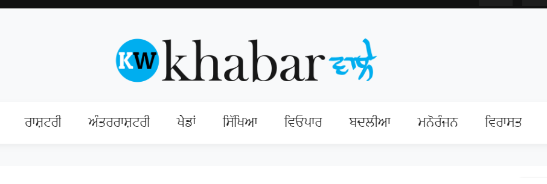

## Khabarwaale News Site
Welcome to Khabarwaale - Your trusted source for the latest news and updates!

## Introduction
Khabarwaale is a comprehensive news website dedicated to providing readers with timely, accurate, and relevant news articles spanning various topics including politics, technology, entertainment, sports, and more.

- **Wide Range of Topics**: From global events to local news, Khabarwaale covers a diverse range of topics to keep you informed and engaged.
- **Timely Updates**: Our team of dedicated journalists works around the clock to deliver the latest news as it happens.
- **User-Friendly Interface**: Navigating through Khabarwaale is easy and intuitive, ensuring a seamless browsing experience for our readers.
- **Responsive Design**: Whether you're accessing Khabarwaale on your desktop, tablet, or smartphone, our website adapts to your device's screen size for optimal viewing.
- **Search Functionality**: Looking for a specific news article? Use our search feature to quickly find what you're looking for.

## Social Media Integration

    Stay connected with us on social media:

- [Facebook](https://www.facebook.com/khabarwaaleofficial/)
- [Twitter](https://twitter.com/khabarwaaletv)
- [Instagram](https://www.instagram.com/khabarwaaletv/)
- [LinkedIn](https://www.linkedin.com/in/khabarwaale-waale-001132168/)
- [YouTube](https://www.youtube.com/c/KhabarwaaleTV)

    Follow us on these platforms for additional updates, behind-the-scenes insights, and engaging content!

## Navigation Links

- [Home](https://www.khabarwaale.com)
- [Punjab News](https://www.khabarwaale.com/category/5/punjab)
- [Chandigarh News](https://www.khabarwaale.com/category/6/chandigarh)
- [National News](https://www.khabarwaale.com/category/7/national)
- [International News](https://www.khabarwaale.com/category/8/world)
- [Sports News](https://www.khabarwaale.com/category/9/sports)
- [Education News](https://www.khabarwaale.com/category/10/education)
- [Business News](https://www.khabarwaale.com/category/11/business)
- [Transfer and Appointments](https://www.khabarwaale.com/category/12/transfer-and-appointments)
- [Lifestyle News](https://www.khabarwaale.com/category/13/lifestyle)
- [Religious News](https://www.khabarwaale.com/category/14/religious)

## How to Use
* Navigation: Use the menu bar located at the top of the page to explore different sections and topics.
* Reading Articles: Click on any headline to read the full article. You can also use the search bar to find specific articles.
* Sharing: Found an article you like? Share it with your friends and followers on social media using the integrated sharing buttons.
* Providing Feedback: We value your feedback! If you have any comments, suggestions, or concerns, feel free to contact us via the provided contact information.

## Contact Us
*  Have questions or feedback? We'd love to hear from you!

 * Email: newskhabarwaale@gmail.com
 * Phone: +91-9815481679
 * Address: C-2, SCO 86-87, TF, ਸੈਕਟਰ 45-C, ਚੰਡੀਗੜ੍ਹ
 * https://www.khabarwaale.com

## Contributions
    We welcome contributions from freelance journalists, writers, and contributors who are passionate about delivering quality news content. If you're interested in contributing to Khabarwaale, please reach out to us via email with your proposal.

## Disclaimer

    While we strive to ensure the accuracy and reliability of the information presented on Khabarwaale, we cannot guarantee the absolute accuracy of all content. Readers are encouraged to cross-reference information and verify facts independently.

* Thank you for choosing Khabarwaale as your go-to source for news and updates! Stay informed, stay connected.
